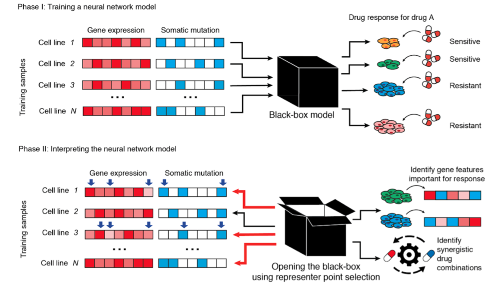

# Using representer point selection for interpretable drug response prediction (OpenDrug)
 

## About
This directory contains the code and resources of the following paper:

<i>"Using representer point selection for interpretable drug response prediction 
" Under review. </i>

## Overview of the Model

 

OpenDrug is a two step interpretable deep learning model for drug response prediction. OpenDrug is a kind of post-hoc
 interpretable deep learning model methods which identify important feature and training example by reanalysis model 
 after 
  whole training process.
### Step 1. Train OpenDrug to predict drug response.
For each drug, we trained a multi-layer neural network model to predict the drug response based on the molecular 
features (gene expression and mutation feature) of each cell
 
### Step 2. Interpreting OpenDrug and identify important training example and feature.
For each drug and each testing cell line, the importance of training data and feature can be interpreted by 
reanalysis the neural network.  

For further details, see Online Methods of our paper. 

## Sub-directories
  - [src] contains implementation of OpenDrug used for the beer review data. 
  - [example_data] contains one example drug data. The drug response data is save as pickle file.
  - [baseline_methods] contains the implementation of baseline methods including elastic net, linear model, random 
  forest, and 
  SVR used
   in comparison.
  - [evaluation] contains the implementation of GCN used in evaluating important training example identified by OpenDrug
  

 

## Data
  - We constructed dataset based on Genomics of Drug Sensitivity in Cancer (GDSC) project(Iorio et al., 2016), which 
  measured the drug responses elicited by a panel of 265 drugs on 1,001 tumor cell lines, which can be found and 
  downloaded at the GDSC website (https://www.cancerrxgene.org/gdsc1000/GDSC1000_WebResources)
  
   - We selected genes from the “mini cancer genome panel” and further removed gene expression features for which the 
   standard 
   deviations fell into the lowest 10% over all the 
   training samples, and gene mutation features with less than 10 somatic mutations across all the training samples.

 

## Dependency
- python 3.7
- pytorch 1.7.0+cu101
- ogb 1.2.4+cu101
- scikit-learn 0.23.2
- lime 0.2.0.1
## Code Usage
1. Train OpenDrug to predict drug response. 
<code>  
cd src\
python train.py --drug_id <drug_id> --data_dir <data_dir> --model_dir <model_dir>\
for example:
python train_LOO.py --drug_id 11 --data_dir ../example_data --model_dir ../model
</code>
    Here, we provide a leave-one-out cross-validation implementation which is convenient for further interpreting model.
    We also provide baseline methods implementation which are compared in our paper. Baseline methods can be trained 
    using 
    following 
    command.\
 <code>
cd baseline_methods\
python run_{elastic_net,linear_model,rf,svr}.py  --drug_id <drug_id> --data_dir <processed data path> --model_dir <path
 to save 
model> \
</code>

2. Interpreting OpenDrug and identify important training example and feature.\
<code> 
cd src\
python generate_representer_matrix_index.py --drug_id <drug_id> --data_dir <processed data path>> --index_list <test_index_list> 
--model_dir <model path> --output_dir <path to save interprate result> 
</code>

    where test_index_list denote the test example index list corresponding to index in processed data pickle. The output 
file is save in numpy format whose weight(Wij) represent importance of feature j on training data i.

3. Evaluating important training example and feature\
    Evaluation 1: OpenDrug perform better than other methods with identified important training feature. \
    <code>cd evaluation\
    python  Open_Drug_feature_selection.py --drug_id <drug_id> --data_dir <processed data path> --index_list 
    <test_index_list> --model_dir <saved training model> --output_dir <path to save performance result> \
    </code>
    Similarly, other feature interpreting baseline can be evaluated by \
    <code> 
    cd evaluation
    python  random_feature_selection.py --drug_id <drug_id> --data_dir <processed data path> --index_list 
    <test_index_list> --output_dir <path to save performance result> \
    python  lime_feature_selection.py --drug_id <drug_id> --data_dir <processed data path> --index_list 
    <test_index_list> --output_dir <path to save performance result> \
    </code>
   The output result is saved in pickle file including predicted drug response and test data index.
   
   
   Evaluation 2: Verifying the representers using graph convolutional networks (GCN).
   <code> 
   cd evaluation\
   python train_gcn.py --data_path <path save processed data and representer graph> --type <random/OpenDrug>\
   </code>
  The output result is saved in pickle file including person correlation with different percentage of top feature 
  selected.
  ---
If you have any question, please feel free to contact to me.
Email: sht18@mails.tsinghua.edu.cn, majianzhu@gmail.com

---

## License
DeepDrug is licensed under the Apache License, Version 2.0: http://www.apache.org/licenses/LICENSE-2.0

